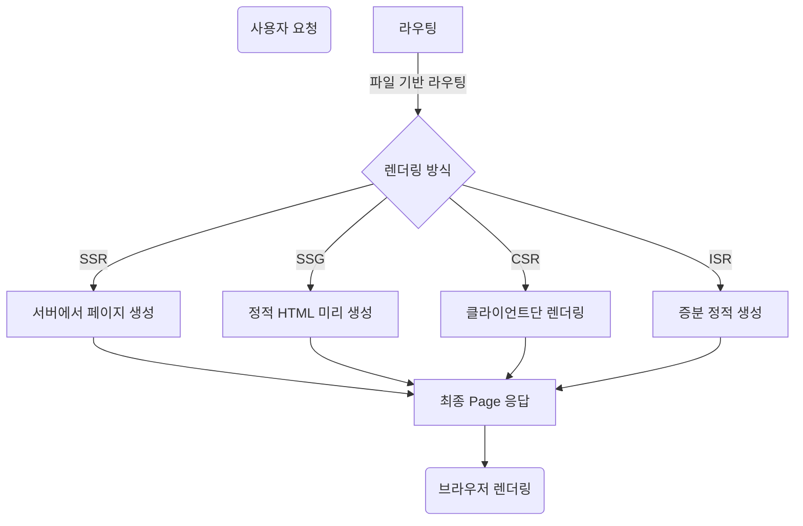

> Next.js는 React 기반의 서버사이드 렌더링(SSR), 정적 사이트 생성(SSG), 클라이언트 사이드 렌더링(CSR), 증분 정적 생성(ISR) 등 다양한 렌더링 방식을 통합적으로 지원하는 최신 웹 프레임워크이다.  
> 자동화된 라우팅, 내장 API, 서버 컴포넌트, 코드스플리팅, SEO 최적화, 클라우드 배포 등 현대적 프론트엔드와 백엔드의 경계를 효율적으로 연결한다.

## 주요 개념

- **SSR/SSG/CSR/ISR 등 멀티 렌더링**
- **파일 기반 라우팅과 API Route**
- **자동 코드스플리팅, 최적화 빌드**
- **서버 컴포넌트 및 최신 React 18, App Router**
- **Vercel과 최적화 배포 환경**

## 실습 예제

```bash
npx create-next-app@latest my-next-app
cd my-next-app
npm run dev
```
**간단한 페이지**  
```jsx
// pages/index.js 또는 app/page.js
export default function Home() {
  return <h1>Hello, Next.js!</h1>;
}
```
**SSR/SSG 예시**  
```jsx
// app/posts/[id]/page.js
export async function generateStaticParams() { return [{ id: '1' }, { id: '2' }]; }
export default async function PostPage({ params }) {
  const data = await fetch(`https://api.example.com/posts/${params.id}`).then(r=>r.json());
  return <div>{data.title}</div>;
}
```
**API Route**  
```js
// pages/api/hello.js
export default function handler(req, res) {
  res.status(200).json({ message: 'Hello API!' });
}
```

## 정리/요약

Next.js는 React 생태계를 아우르는 올인원 프레임워크다.  
현대적인 데이터 페칭, 렌더링, API 설계, 클라우드 배포까지 효율과 확장성을 극대화한다.

## 참고 자료

- [Next.js 공식문서](https://nextjs.org/docs/getting-started)
- [App Router 가이드](https://nextjs.org/docs/app/building-your-application/routing)
- [React Server Components](https://nextjs.org/docs/app/building-your-application/rendering/server-components)

---

# 추가 설명

## 최신 구조/흐름도 (Mermaid 차트)



## React 단독 개발과 Next.js 실무 비교

- **React**
  - CSR(클라이언트 렌더링)에 특화되어 있어 초기 HTML은 비어 있다가 JS 실행 시 인터랙티브해진다.
  - SEO, 초기 로딩 개선, API 통합 등은 개발자가 직접 구현해야 한다.

- **Next.js**
  - SSR/SSG 지원으로 SEO 및 성능 이슈가 해결된다.
  - 클라우드 배포, 접속 로깅, 이미지 최적화 등도 내장.
  - 디렉터리 구조만 갖추면 라우팅/API 생성 자동화(설정 최소화).

## 최신 실무 트렌드 및 추천 활용법
- **App Directory 기반 Server Component**: 초기 데이터 페칭, SEO/성능/보안 강화.
- **API Route, 미들웨어 적극 활용**: 인증, 실시간 데이터 등도 손쉽게 구현.
- **배포 자동화(Vercel 등)**: 커밋마다 자동 배포, 무중단 롤백 표준화.

## 참고자료 (요약)
- 공식 가이드: [Next.js App Router](https://nextjs.org/docs/app/building-your-application/routing)
- Server vs Client Components: [공식 설명](https://nextjs.org/docs/app/building-your-application/rendering/server-components)
- 실무 예제 모음: [Vercel Examples](https://github.com/vercel/examples)
